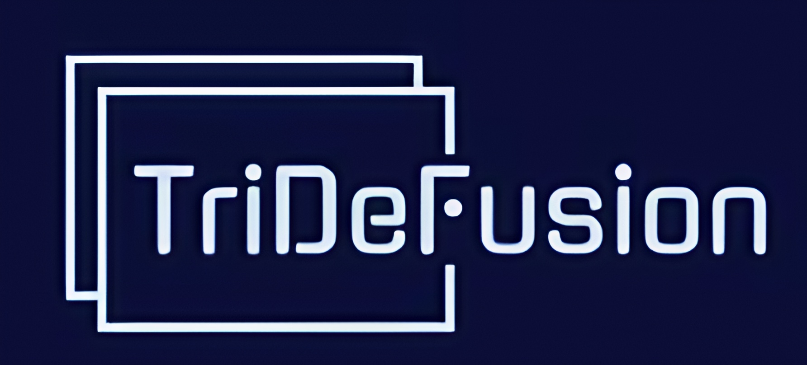

# TriDeFusion: Denoising method for fluorescence microscopy
<!-- 

[](LICENSE)
[]()
[]()
[](https://github.com/Biomed-imaging-lab/SpineTool/issues) -->


<br />
<div align="center">
  <a href="https://github.com/Biomed-imaging-lab/TriDeFusion">
    
  </a>

  <h2 align="center">TriDeFusion</h2>

  _Tri - three-dimensional images , De - denoising task, Fusion - integration of multiple techniques._

  Dendritic spine analysis tool for dendritic spine image segmentation, dendritic spine morphologies extraction, analysis and clustering.

  <div align="center" style="line-height: 1;">
  <a href="https://www.deepseek.com/" target="_blank" style="margin: 2px;">
    
  </a>
  <a href="https://chat.deepseek.com/" target="_blank" style="margin: 2px;">
    
  </a>
  <a href="https://huggingface.co/TriDeFusion" target="_blank" style="margin: 2px;">
    
  </a>
</div>

  


  <p align="center">
    <br />
    <a href="https://doi.org/10.1109/SIBIRCON63777.2024.10758532"><strong> Explore the research paper »</strong></a>
    <br />
    <a href="#Citation">Cite</a>
    ·
    <a href="https://github.com/IMZolin/frt-web">FRT web service</a>
    ·
    <a href="https://github.com/gerasimenkoab/simple_psf_extractor">FRT Desktop GitHub</a>
    ·
    <a href="https://static-content.springer.com/esm/art%3A10.1038%2Fs41598-023-37406-4/MediaObjects/41598_2023_37406_MOESM1_ESM.pdf">Read FRT Tutorial</a>
    ·
    <a href="mailto:zolin.work@yandex.ru&subject=TriDeFusion_feedback">Connect</a>
  </p>

[](https://www.facebook.com/sharer/sharer.php?u=https://github.com/Biomed-imaging-lab/TriDeFusion)
[](https://www.linkedin.com/shareArticle?mini=true&url=https://github.com/Biomed-imaging-lab/TriDeFusion)
[](https://www.reddit.com/submit?title=Check%20out%20this%20project%20on%20GitHub:%20https://github.com/Biomed-imaging-lab/TriDeFusion)
[](https://t.me/share/url?url=https://github.com/Biomed-imaging-lab/TriDeFusion&text=Check%20out%20this%20project%20on%20GitHub)
</div>

[Ivan, Z., Vyacheslav, C., Ekaterina, P. (2024). TriDeFusion: Enhanced denoising algorithm for 3D fluorescence microscopy images integrating modified Noise2Noise and Non-local means. IEEE International Multi-Conference on Engineering, Computer and Information Sciences (SIBIRCON). 
10.1109/SIBIRCON63777.2024.10758532.](https://doi.org/10.1109/SIBIRCON63777.2024.10758532)

<div align="center" style="display: flex; justify-content: center; align-items: center; max-width:100%">
  <figure style="display: inline-block; margin: 0 10px;">
    
    <figcaption>Figure 1: Results of TriDeFusion</figcaption>
  </figure>
  <figure style="display: inline-block; margin: 0 10px;">
    
    <figcaption>Figure 2: Results of TriDeFusion</figcaption>
  </figure>
</div>


## Overview

_Fluorescence microscopy is a technique for obtaining images of luminous objects of small size. It is widely used in fields ranging from materials science to neurobiology. Fluorescence microscopy has several advantages over other forms of microscopy, offering high sensitivity and specificity. However, it often results in images with noise and distortions, complicating subsequent analysis. This paper introduces the TriDeFusion algorithm for 3D image denoising, integrating Non-Local Means (NLM) and Modified Noise2Noise (N2N) techniques. Our results show that TriDeFusion significantly improves image quality, particularly in preserving details while reducing noise. In experiments with synthetic data, the combined methods outperformed individual approaches in both Root Mean Square Error (RMSE) and Peak Signal-to-Noise Ratio (PSNR) metrics, achieving up to a 54% reduction in RMSE and a 20% increase in PSNR. For real data, our algorithm demonstrated a significant reduction of noise mean intensity by over 50% and variance by 33%, confirming its robustness and effectiveness across different noise levels and data types._

<div align="center">
<figure>
  
  <figcaption>Figure 1: Denoising method</figcaption>
</figure>

<figure>
  
  <figcaption>Figure 2: This is a beautiful caption below the image.</figcaption>
</figure>
</div>

<!-- <div align="center">
  
</div>
<hr>
<div align="center" style="line-height: 1;">
  <a href="https://www.deepseek.com/" target="_blank" style="margin: 2px;">
    
  </a>
  <a href="https://chat.deepseek.com/" target="_blank" style="margin: 2px;">
    
  </a>
  <a href="https://huggingface.co/deepseek-ai" target="_blank" style="margin: 2px;">
    
  </a>
</div>

[](https://www.facebook.com/sharer/sharer.php?u=https://github.com/Biomed-imaging-lab/SpineTool)
[](https://www.linkedin.com/shareArticle?mini=true&url=https://github.com/Biomed-imaging-lab/SpineTool)
[](https://www.reddit.com/submit?title=Check%20out%20this%20project%20on%20GitHub:%20https://github.com/Biomed-imaging-lab/SpineTool)
[](https://t.me/share/url?url=https://github.com/Biomed-imaging-lab/SpineTool&text=Check%20out%20this%20project%20on%20GitHub)

</div> -->


## System requirements

- Python 3.12.8
- PyTorch 2.0
- CUDA 11.8
- cuDNN 8.9
- NVIDIA GPU with at least 8GB VRAM

## Directory structure

<details>
  <summary>Click to unfold the directory tree</summary>

<details>
  <summary>Click to unfold the directory tree</summary>

```
TriDeFusion
|---bin # 
|---|---download_dataset.sh 
|---|---download_pretrained.sh
|---|---unzip_dataset.sh
|---config #
|---|---inference_config.yml
|---|---test_config.yml
|---|---train_config.yml
|---dataset #
|---experiments #
|---figures #
|---models #
|---tests #
|---utils #
|---notebooks #
|---app.py #
|---inference.py #

|---|---|---__init__.py
|---|---|---utils.py
|---|---|---network.py
|---|---|---model_3DUnet.py
|---|---|---data_process.py
|---|---|---buildingblocks.py
|---|---|---test_collection.py
|---|---|---train_collection.py
|---|---|---movie_display.py
|---|---notebooks
|---|---|---demo_train_pipeline.ipynb
|---|---|---demo_test_pipeline.ipynb
|---|---|---DeepCAD_RT_demo_colab.ipynb
|---|---datasets
|---|---|---DataForPytorch # project_name #
|---|---|---|---data.tif
|---|---pth
|---|---|---ModelForPytorch
|---|---|---|---model.pth
|---|---|---|---model.yaml
|---|---onnx
|---|---|---ModelForPytorch
|---|---|---|---model.onnx
|---|---results
|---|---|--- # test results#
```

</details>


###  Project Index
<details open>
	<summary><b><code>TriDeFusion/</code></b></summary>
	<details> <!-- __root__ Submodule -->
		<summary><b>__root__</b></summary>
		<blockquote>
			<table>
			<tr>
				<td><b><a href='https://github.com/Biomed-imaging-lab/TriDeFusion/blob/master/enviroment.yml'>enviroment.yml</a></b></td>
				<td>Manage project dependencies using the provided requirements.txt file to ensure proper functioning of the codebase architecture.</td>
			</tr>
			<tr>
				<td><b><a href='https://github.com/Biomed-imaging-lab/TriDeFusion/blob/master/pyproject.toml'>pyproject.toml</a></b></td>
				<td>Configure code formatting and linting rules in the project using the provided pyproject.toml file.</td>
			</tr>
      <tr>
				<td><b><a href='https://github.com/Biomed-imaging-lab/TriDeFusion/blob/master/pyproject.toml'>Makefile</a></b></td>
				<td>Configure code formatting and linting rules in the project using the provided pyproject.toml file.</td>
			</tr>
			</table>
		</blockquote>
	</details>
	<details> <!-- datasets Submodule -->
		<summary><b>datasets</b></summary>
		<blockquote>
			<table>
			<tr>
				<td><b><a href='https://github.com/Biomed-imaging-lab/NeuroRAG/blob/master/datasets/mmlu.ipynb'>mmlu.ipynb</a></b></td>
				<td>- Generates a dataset by aggregating questions and answers from various subsets related to anatomy, biology, medicine, and psychology<br>- The resulting CSV file 'mmlu.csv' contains a comprehensive collection of questions and their corresponding answers for further analysis and processing within the project architecture.</td>
			</tr>
			<tr>
				<td><b><a href='https://github.com/Biomed-imaging-lab/NeuroRAG/blob/master/datasets/medmcqa.ipynb'>medmcqa.ipynb</a></b></td>
				<td>- The code file `medmcqa.ipynb` in the datasets directory of the project is responsible for importing datasets and pandas for data manipulation<br>- It likely plays a role in loading and preprocessing medical multiple-choice question and answer data for further analysis within the project architecture.</td>
			</tr>
			<tr>
				<td><b><a href='https://github.com/Biomed-imaging-lab/NeuroRAG/blob/master/datasets/final.ipynb'>final.ipynb</a></b></td>
				<td>Merge datasets to create a comprehensive final dataset for analysis and export it as a CSV file.</td>
			</tr>
			<tr>
				<td><b><a href='https://github.com/Biomed-imaging-lab/NeuroRAG/blob/master/datasets/mediqa.ipynb'>mediqa.ipynb</a></b></td>
				<td>- The code file `datasets/mediqa.ipynb` in the project architecture integrates datasets and performs data processing tasks using language models and prompts from the Langchain framework<br>- It leverages the Ollama language model system and PromptTemplate for generating outputs related to medical question answering.</td>
			</tr>
			<tr>
				<td><b><a href='https://github.com/Biomed-imaging-lab/NeuroRAG/blob/master/datasets/brainscape.ipynb'>brainscape.ipynb</a></b></td>
				<td>- Extracts data from a website to create a dataset of flashcards related to neurobiology<br>- The code initializes an empty DataFrame, scrapes URLs, extracts flashcard content, and saves the data to a CSV file<br>- This process automates the collection of educational content for further analysis and study.</td>
			</tr>
			</table>
		</blockquote>
	</details>
	<details> <!-- neurorag Submodule -->
		<summary><b>neurorag</b></summary>
		<blockquote>
			<table>
			<tr>
				<td><b><a href='https://github.com/Biomed-imaging-lab/NeuroRAG/blob/master/neurorag/neurorag.py'>neurorag.py</a></b></td>
				<td>- The `neurorag.py` file in the project serves as a central hub for integrating various components such as document processing, embeddings, retrievers, and chains for tasks like document grading, answer grading, and query rewriting<br>- It orchestrates the flow of data and operations through the different modules to enable advanced language processing and graph-based operations within the codebase architecture.</td>
			</tr>
			</table>
			<details>
				<summary><b>retrievers</b></summary>
				<blockquote>
					<table>
					<tr>
						<td><b><a href='https://github.com/Biomed-imaging-lab/NeuroRAG/blob/master/neurorag/retrievers/NCBIRetriever.py'>NCBIRetriever.py</a></b></td>
						<td>- Retrieves and processes gene or protein data from the NCBI database based on a search query<br>- Generates structured documents with relevant information for each gene or protein record fetched.</td>
					</tr>
					</table>
				</blockquote>
			</details>
			<details>
				<summary><b>chains</b></summary>
				<blockquote>
					<table>
					<tr>
						<td><b><a href='https://github.com/Biomed-imaging-lab/NeuroRAG/blob/master/neurorag/chains/fusing.py'>fusing.py</a></b></td>
						<td>- The `FusingChain` class orchestrates the merging of multiple AI-generated responses into a coherent and comprehensive answer<br>- It evaluates, identifies common answers, synthesizes information, and formats the final response in JSON format<br>- By leveraging various components like parsers, prompts, and runnables, it intelligently combines insights from different sources to produce a unified output.</td>
					</tr>
					<tr>
						<td><b><a href='https://github.com/Biomed-imaging-lab/NeuroRAG/blob/master/neurorag/chains/ncbi_protein.py'>ncbi_protein.py</a></b></td>
						<td>- Facilitates transforming user queries into precise NCBI protein database searches<br>- Utilizes Pydantic for schema validation and RetryOutputParser for handling retries<br>- Implements a chain of operations including prompt generation, language model processing, and data retrieval<br>- Enables efficient query optimization for bioinformatics experts.</td>
					</tr>
					<tr>
						<td><b><a href='https://github.com/Biomed-imaging-lab/NeuroRAG/blob/master/neurorag/chains/hyde.py'>hyde.py</a></b></td>
						<td>- Enables generation of scientific paper passages in response to queries by chaining together a prompt, language model, and output parser<br>- The HyDEChain class initializes the chain and provides a method to invoke it with a query, returning the generated passage.</td>
					</tr>
					<tr>
						<td><b><a href='https://github.com/Biomed-imaging-lab/NeuroRAG/blob/master/neurorag/chains/step_back.py'>step_back.py</a></b></td>
						<td>- Generates step-back queries to enhance context retrieval in a RAG system<br>- Utilizes a chain of processes to create broader, more general queries based on the original input<br>- The code orchestrates the flow of operations, including parsing, prompting, and invoking the query generation process.</td>
					</tr>
					<tr>
						<td><b><a href='https://github.com/Biomed-imaging-lab/NeuroRAG/blob/master/neurorag/chains/generation.py'>generation.py</a></b></td>
						<td>- The `GenerationChain` class orchestrates multiple language models to fuse responses for question-answering tasks<br>- It integrates GPT, OpenBio, and Mistral models, combining their outputs to generate a coherent response<br>- The class encapsulates the logic for invoking the models and fusing their responses, providing a streamlined interface for generating answers based on user queries and context.</td>
					</tr>
					<tr>
						<td><b><a href='https://github.com/Biomed-imaging-lab/NeuroRAG/blob/master/neurorag/chains/route.py'>route.py</a></b></td>
						<td>- Defines a RouteChain class that orchestrates retrieval methods for user questions<br>- It leverages Pydantic for data validation and RetryOutputParser for error handling<br>- The class encapsulates a chain of operations, including prompts, language models, and JSON extraction, to process user queries effectively.</td>
					</tr>
					<tr>
						<td><b><a href='https://github.com/Biomed-imaging-lab/NeuroRAG/blob/master/neurorag/chains/json_extractor.py'>json_extractor.py</a></b></td>
						<td>Extracts the last JSON object from input data, removing escape characters.</td>
					</tr>
					<tr>
						<td><b><a href='https://github.com/Biomed-imaging-lab/NeuroRAG/blob/master/neurorag/chains/document_grade.py'>document_grade.py</a></b></td>
						<td>- Implement a document grading chain that assesses document relevance to a user query<br>- Utilizes Pydantic for schema validation and RetryOutputParser for error handling<br>- The chain orchestrates prompts, language models, and JSON extraction to evaluate and assign a binary relevance score ('yes' or 'no') based on keyword and semantic alignment between the query and document.</td>
					</tr>
					<tr>
						<td><b><a href='https://github.com/Biomed-imaging-lab/NeuroRAG/blob/master/neurorag/chains/ncbi_gene.py'>ncbi_gene.py</a></b></td>
						<td>- Facilitates transforming user questions into precise queries for the NCBI gene database<br>- Utilizes a chain of operations to optimize user queries, parse outputs, and retrieve gene loci<br>- The code orchestrates a series of steps to enhance user query effectiveness and streamline database searches.</td>
					</tr>
					<tr>
						<td><b><a href='https://github.com/Biomed-imaging-lab/NeuroRAG/blob/master/neurorag/chains/answer_grade.py'>answer_grade.py</a></b></td>
						<td>- Defines an Answer Grade Chain that assesses if an answer resolves a question<br>- It utilizes a binary scoring system ('yes' or 'no') based on user input and LLM generation<br>- The chain includes a retry mechanism and various parsers for processing the input<br>- The main purpose is to evaluate answers and provide a binary score indicating if the question is addressed.</td>
					</tr>
					<tr>
						<td><b><a href='https://github.com/Biomed-imaging-lab/NeuroRAG/blob/master/neurorag/chains/decomposition.py'>decomposition.py</a></b></td>
						<td>- Facilitates decomposition of complex queries into simpler sub-queries for a RAG system<br>- Parses input query, generates sub-queries, and handles retries for comprehensive responses<br>- Integrates Pydantic for schema validation and prompts for user interaction<br>- Orchestrates parallel execution of components for efficient processing.</td>
					</tr>
					<tr>
						<td><b><a href='https://github.com/Biomed-imaging-lab/NeuroRAG/blob/master/neurorag/chains/query_rewriting.py'>query_rewriting.py</a></b></td>
						<td>- Enables query rewriting for improved information retrieval in a RAG system by reformulating user queries<br>- The code defines a schema for rewritten queries, sets up a prompt template for AI assistants, and constructs a chain for query processing using various components like parsers and extractors<br>- The QueryRewritingChain class facilitates invoking the chain to generate more specific and relevant queries.</td>
					</tr>
					<tr>
						<td><b><a href='https://github.com/Biomed-imaging-lab/NeuroRAG/blob/master/neurorag/chains/hallucinations.py'>hallucinations.py</a></b></td>
						<td>- Facilitates assessing if an LLM answer aligns with facts by providing a binary score<br>- Utilizes a structured template for grading and incorporates Pydantic for parsing<br>- Implements a chain of operations to process input and generate the binary score.</td>
					</tr>
					</table>
				</blockquote>
			</details>
		</blockquote>
	</details>
	<details> <!-- apps Submodule -->
		<summary><b>apps</b></summary>
		<blockquote>
			<table>
			<tr>
				<td><b><a href='https://github.com/Biomed-imaging-lab/NeuroRAG/blob/master/apps/grades.json'>grades.json</a></b></td>
				<td>- Summarize the purpose and use of the `apps/grades.json` file in the project architecture, focusing on its role in storing detailed information about NMDA receptors, their subunit compositions, and their significance in various physiological and pathological processes<br>- This file serves as a comprehensive reference for understanding the critical functions and importance of NMDA receptors in brain function and neurological disorders.</td>
			</tr>
			<tr>
				<td><b><a href='https://github.com/Biomed-imaging-lab/NeuroRAG/blob/master/apps/llm-arena.py'>llm-arena.py</a></b></td>
				<td>- Generates and saves rankings of answers from neural networks for given questions in the LLM-arena app<br>- Users rank answers by preference, with the option to save rankings for analysis<br>- The code orchestrates the interaction between the neural networks, user interface, and data storage, facilitating user engagement and data collection.</td>
			</tr>
			<tr>
				<td><b><a href='https://github.com/Biomed-imaging-lab/NeuroRAG/blob/master/apps/api.py'>api.py</a></b></td>
				<td>- Implements a FastAPI endpoint for invoking a NeuroRAG model to answer questions based on pre-loaded documents<br>- The code initializes the model with pre-processed documents and handles incoming queries to generate answers.</td>
			</tr>
			<tr>
				<td><b><a href='https://github.com/Biomed-imaging-lab/NeuroRAG/blob/master/apps/app.py'>app.py</a></b></td>
				<td>- The code orchestrates a Streamlit chatbot interface for NeuroRAG, enabling users to interact with the chatbot for assistance<br>- It manages chat messages, user prompts, and responses, along with the display of documents and sources<br>- The interface allows users to engage in conversations with the chatbot, receive generated content, and view relevant documents within the application.</td>
			</tr>
			</table>
			<details>
				<summary><b>.streamlit</b></summary>
				<blockquote>
					<table>
					<tr>
						<td><b><a href='https://github.com/Biomed-imaging-lab/NeuroRAG/blob/master/apps/.streamlit/config.toml'>config.toml</a></b></td>
						<td>Customize the primary color theme for the Streamlit app in the project configuration file located at apps/.streamlit/config.toml.</td>
					</tr>
					</table>
				</blockquote>
			</details>
		</blockquote>
	</details>
	<details> <!-- notebooks Submodule -->
		<summary><b>notebooks</b></summary>
		<blockquote>
			<table>
			<tr>
				<td><b><a href='https://github.com/Biomed-imaging-lab/NeuroRAG/blob/master/notebooks/mmlu.ipynb'>mmlu.ipynb</a></b></td>
				<td>- Summary:
The code file `mmlu.ipynb` in the notebooks directory is dedicated to evaluating language models using the Massive Multitask Language Understanding (MMLU) benchmark<br>- This benchmark assesses language models across a wide range of domains, spanning from fundamental topics like history and mathematics to specialized fields such as law and medicine<br>- The code facilitates the evaluation of language understanding capabilities in diverse subject areas, contributing to the enhancement of language models' performance and applicability across various domains within the project architecture.</td>
			</tr>
			<tr>
				<td><b><a href='https://github.com/Biomed-imaging-lab/NeuroRAG/blob/master/notebooks/raw-llms.ipynb'>raw-llms.ipynb</a></b></td>
				<td>- The code file `raw-llms.ipynb` in the project structure is responsible for importing necessary packages and setting up the initial environment for natural language processing tasks<br>- It handles tasks such as data preprocessing, feature extraction, and evaluation using various libraries like NLTK, NumPy, Pandas, and scikit-learn<br>- This notebook serves as a foundational step in the data processing pipeline of the project, ensuring that the data is ready for further analysis and modeling.</td>
			</tr>
			<tr>
				<td><b><a href='https://github.com/Biomed-imaging-lab/NeuroRAG/blob/master/notebooks/RAPTOR.ipynb'>RAPTOR.ipynb</a></b></td>
				<td>- The code file `RAPTOR.ipynb` in the notebooks directory serves as a key component in the project architecture<br>- It plays a crucial role in leveraging the RAPTOR algorithm to enhance the project's capabilities<br>- This code file facilitates the efficient processing and analysis of data, contributing significantly to the project's overall functionality and performance.</td>
			</tr>
			<tr>
				<td><b><a href='https://github.com/Biomed-imaging-lab/NeuroRAG/blob/master/notebooks/cosine-evaluation.ipynb'>cosine-evaluation.ipynb</a></b></td>
				<td>- The `cosine-evaluation.ipynb` file in the project focuses on evaluating cosine similarity using GraphRAG<br>- It imports necessary packages, processes data, and calculates cosine similarity scores for the project's text data<br>- This evaluation is crucial for understanding the semantic similarity between different text elements within the project's architecture.</td>
			</tr>
			<tr>
				<td><b><a href='https://github.com/Biomed-imaging-lab/NeuroRAG/blob/master/notebooks/llm-blender.ipynb'>llm-blender.ipynb</a></b></td>
				<td>- Summary:
The code file `llm-blender.ipynb` in the `notebooks` directory serves the purpose of importing necessary packages for the project<br>- It ensures that the required dependencies, such as NLTK and NumPy, are already installed and available for use in the project's workflow<br>- This file plays a crucial role in setting up the environment and enabling the project to leverage these essential libraries seamlessly.</td>
			</tr>
			<tr>
				<td><b><a href='https://github.com/Biomed-imaging-lab/NeuroRAG/blob/master/notebooks/mmlu-evaluation.ipynb'>mmlu-evaluation.ipynb</a></b></td>
				<td>- The code file `mmlu-evaluation.ipynb` in the notebooks directory of the project focuses on utilizing the GraphRAG library for evaluating machine learning models<br>- It imports necessary packages, processes data, and likely contains code for model evaluation and analysis<br>- This file plays a crucial role in assessing the performance and effectiveness of machine learning models within the project's architecture.</td>
			</tr>
			</table>
		</blockquote>
	</details>
</details>

</details>

## Installation

0. Before installation, you could install the [Miniconda (Anaconda)](https://docs.anaconda.com/miniconda/install/), [Docker*](https://docs.docker.com/get-docker/),[Makefile*](docs/make_doc.md).

`* - Optional`

1. Clone the repository

    ```bash
    git clone https://github.com:Biomed-imaging-lab/TriDeFusion.git
    cd TriDeFusion
    ```

2. Create and activate a conda environment

    ```bash
    make install
    ```

    <details>
      <summary>Or using conda manually</summary>

      ```bash
      conda env create -f environment.yml
      conda activate tridefusion
      ```
      
    </details>

    


<!-- 3. Install dependencies

### PIP Option

```bash
pip install -r requirements.txt
```

### Conda Option

```bash


conda create -n frt python=3.10
conda activate frt
pip install -r requirements.txt
``` -->


## Dataset

- [Fluorescence microscopy denoising (FMD) dataset](https://drive.google.com/drive/folders/1aygMzSDdoq63IqSk-ly8cMq0_owup8UM)

  - [FMD GitHub](https://github.com/yinhaoz/denoising-fluorescence)

## Training

There are two ways to train the model. First you can train the model using the following command line arguments. Second you can use a config file (`train_config.yml`). The third way is to use a jupyter notebook ([`netrwok_trainer.ipynb`](notebooks/netrwok_trainer.ipynb)).


1. Using a command line.

    ```bash
    python train.py \
        --exp-name="fluoro-msa" \
        --data-root="./dataset" \
        --imsize=256 \
        --chunk-size=128 \
        --offset-size=64 \
        --in-channels=1 \
        --out-channels=1 \
        --transform="center_crop" \
        --epochs=250 \
        --batch-size=32 \
        --loss-params=1.0,0.2,0.1 \ # alpha, beta, gamma for Loss function
        --lr=5e-4 \
        --cuda=0 \
        --test-group=19 \
        --noise-levels-train=1,2,4,8,16 \
        --noise-levels-test=1 \
        --training-type="standard" # "distillation" for distillation training (UNet-Attention)
    ```

2. Using a config file (`train_config.yml`):

    ```
    python train.py --config train_config.yml
    ```

## Validation

## Inference

1. Using a command line

    ```bash
    python inference.py \
        --noisy_img ./test_images/noisy_tubes.tif \
        --denoise_method tri_de_fusion \
        --model_path ./experiments/n2n/models/best_model.pth \
        --output ./test_images/denoised_tubes.tif
    ```

2. Using a config file (`inference_config.yml`):

    ```
    python inference.py --config inference_config.yml
    ```

## Testing

```bash
python test.py \
    --exp_name n2n \
    --exp_dir ./experiments \
    --cuda 0
```

## FastAPI service

### Introduction

### Docker deployment

```bash
make deploy
```

## Citation

If you use this code please cite the companion paper where the original method appeared:

Li, X., Zhang, G., Wu, J. et al. Reinforcing neuron extraction and spike inference in calcium imaging using deep self-supervised denoising. Nat Methods (2021). https://doi.org/10.1038/s41592-021-01225-0

```latex
%FRT, TriDeFusion-v2 citation
@inproceedings{zhang2018poisson,
    title={FRT (Fluorescence Restoration Techniques) - Integrated desktop and web platform solution for advanced fluorescence microscopy denoising and deconvolution techniques},
    author={Ivan Zolin and Alexander Gerasimenko and Vyacheslav Chukanov and Ekaterina Pchitskaya},
    booktitle={CVPR},
    year={2025}
}

%TriDeFusion-v1 citation
@INPROCEEDINGS{10758532,
  author={Zolin, Ivan and Chukanov, Vyacheslav and Pchitskaya, Ekaterina},
  booktitle={2024 IEEE International Multi-Conference on Engineering, Computer and Information Sciences (SIBIRCON)}, 
  title={TriDeFusion: Enhanced denoising algorithm for 3D fluorescence microscopy images integrating modified Noise2Noise and Non-local means}, 
  year={2024},
  volume={},
  number={},
  pages={211-216},
  keywords={Three-dimensional displays;PSNR;Microscopy;Noise;Noise reduction;Fluorescence;Filtering algorithms;Sensitivity and specificity;Root mean square;Synthetic data;fluorescence microscopy;confocal microscopy;denoising;computer vision;deep learning;convolution neural network},
  doi={10.1109/SIBIRCON63777.2024.10758532}}
```

## Baselines

- Noise2Noise
- Non-local Means
- UNet
- CARE
- 3D-RCAN
- DeepCAD-RT


## License

`TriDeFusion` is distributed under the terms of the [GPL-3.0](https://spdx.org/licenses/GPL-3.0-or-later.html) license.


## Acknowledgments

- Thanks to the contributors of the [FRT](https://appliedmath.gitlab.yandexcloud.net/lmn/frt) project for the inspiration and the codebase.
- This project is supported by Laboratory of biomedical imaging and data analysis.

## Project status

If you have run out of energy or time for your project, put a note at the top of the README saying that development has slowed down or stopped completely. Someone may choose to fork your project or volunteer to step in as a maintainer or owner, allowing your project to keep going. You can also make an explicit request for maintainers.

## Contact 

If you have any questions, please raise an issue or contact us at service@deepseek.com.
